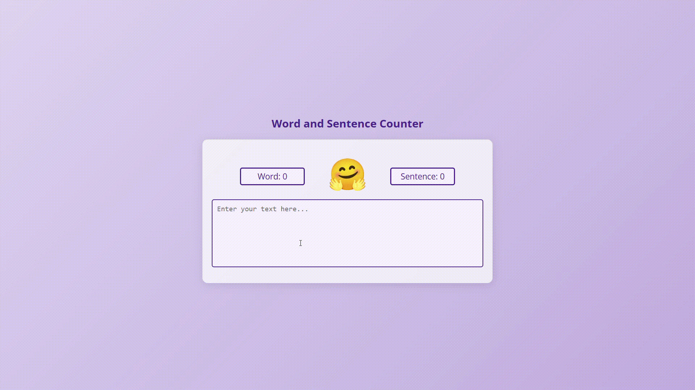

# Laboratory Activity 3: Word and Sentence Counter 

## Overview
This laboratory activity implements a dynamic word and sentence counter using HTML, CSS, and JavaScript. The application provides real-time counting of words and sentences as users type.

## Key Features
- Real-time word counting
- Sentence detection and counting
- Interactive user interface
- Responsive design

## Technologies Used
- HTML5
- CSS3
- JavaScript

## Key Syntax and Concepts Used

### HTML Structure
```html
<div class="counter-container">
    <textarea id="text-input"></textarea>
    <div class="stats">
        <div id="word-count"></div>
        <div id="sentence-count"></div>
    </div>
</div>
```

### JavaScript Counter Logic
```javascript
function countWords(text) {
    return text.trim().split(/\s+/).filter(word => word.length > 0).length;
}

function countSentences(text) {
    return text.split(/[.!?]+/).filter(sentence => sentence.trim().length > 0).length;
}

// Event listener for real-time counting
textInput.addEventListener('input', function() {
    updateCounts();
});
```

### CSS Styling
```css
.counter-container {
    display: flex;
    flex-direction: column;
    gap: 1rem;
}

.stats {
    display: flex;
    justify-content: space-around;
}
```

## Project Structure
```
├── index.html    # Main HTML file
├── style.css     # CSS styling
├── script.js     # JavaScript functionality
└── README.md     # Project documentation
```

## Output


## Learning Outcomes
- DOM manipulation with JavaScript
- Event handling
- Regular expressions for text processing
- Real-time user interface updates
